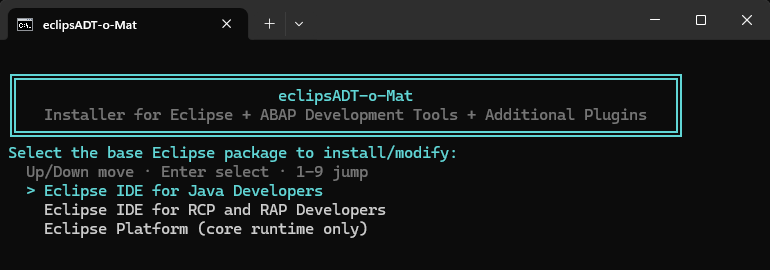
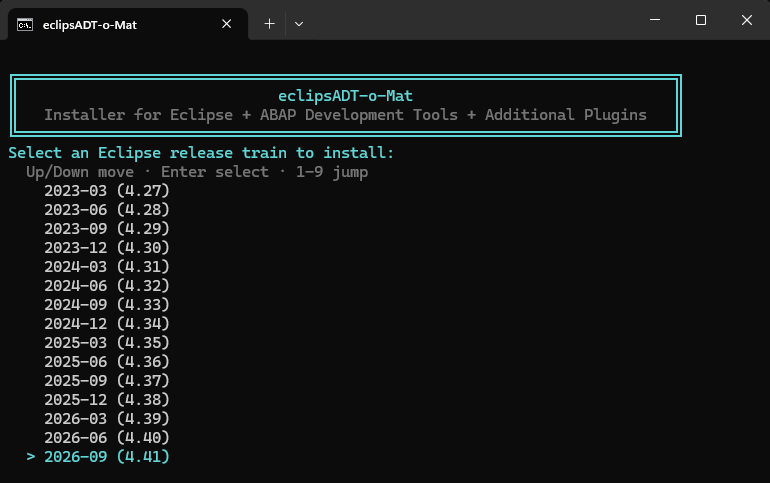
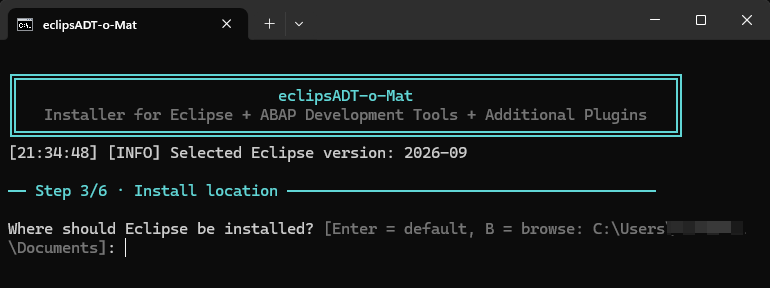
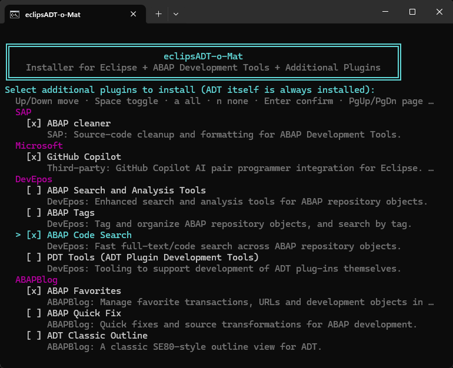
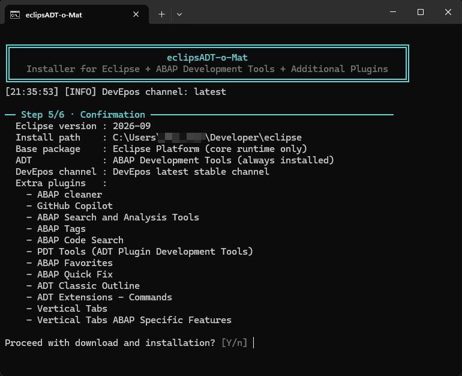
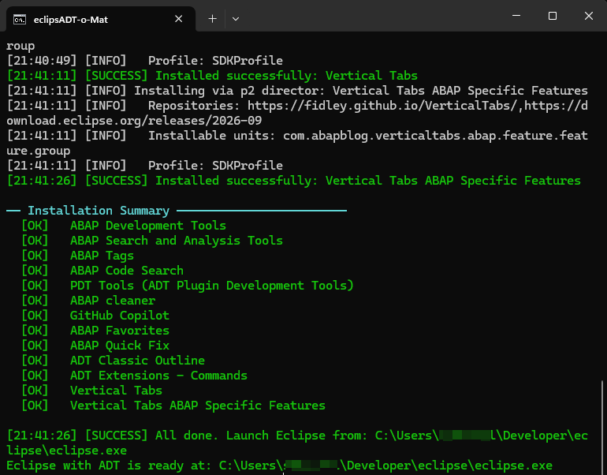

# Step-by-Step Walkthrough

This page shows what running the eclipsADT-o-Mat wizard actually looks like,
step by step, from launch to a ready-to-use Eclipse + ADT installation.

## 1. Base Eclipse package selection

Choose the base Eclipse package to install: "Eclipse IDE for Java
Developers", "Eclipse IDE for RCP and RAP Developers", or "Eclipse Platform"
(core runtime only).

## 2. Eclipse release train selection

Pick the Eclipse release train to install. The latest version supported by
the chosen base package is preselected.

## 3. Installation folder selection

Choose where Eclipse should be installed, or accept the suggested default
path.

## 4. Plugin selection

Select which additional ADT plugins to install alongside ADT itself, which
is always installed.

## 5. Confirmation

Review a summary of all selections before the download and installation
begins.

## 6. Installation summary

Once installation finishes, a summary shows the status of every installed
component and the path to launch Eclipse.

